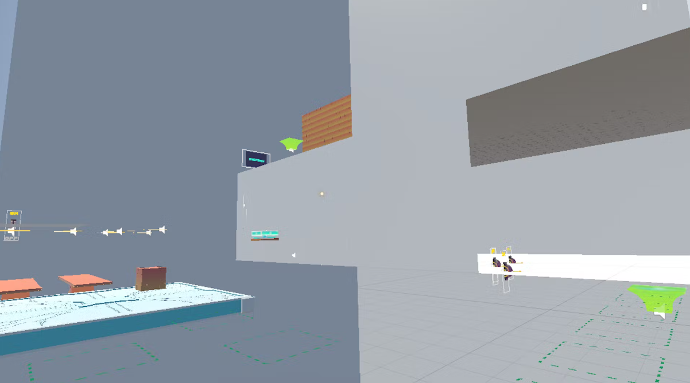
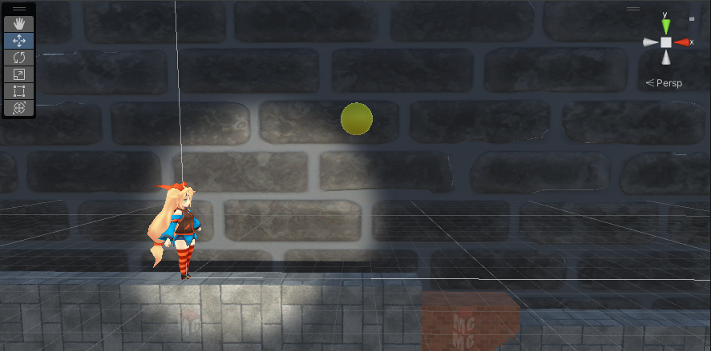

# portfolio
- 中村遥人
- 連絡先　Twitter @ / Email harutonakamura.dat@gmail.com
- 専門学校デジタルアーツ東京　ゲームプログラムコース　2024年卒業予定

## 資格
- 情報技術検定　２級
- 計算技術検定　３級

## スキル
- C/C++
  - 利用歴２年
  - コンソールで簡単なデータ処理プログラムを開発

- Unity
  - 利用歴２年
  - オリジナルの個人作品の開発経験あり

- Unreal Engine
  - 利用歴１年
  - オリジナルにチーム作品の開発経験あり

- cluster
  - 利用歴１年
  - cluster creator kitでのワールド作成

## 取り組んでいるテーマ
1. オリジナルゲーム開発

## 作品リスト
1. Tower Of Challenge
2. Re:Start

# 1. Tower Of Challenge

[3Dアクションゲーム]アスレチックを突破して、塔の頂上を目指すゲーム

開発環境　cluster
開発期間　２～３カ月

# 2. Re:Start

[3D横スクロールアクション]スタートに戻るギミックを駆使して、クリアを目指すゲーム

開発環境　Unity
開発期間　現在開発中

## 連絡先
- ブログ
- Twitter
- Email harutonakamura.dat@gmail.com